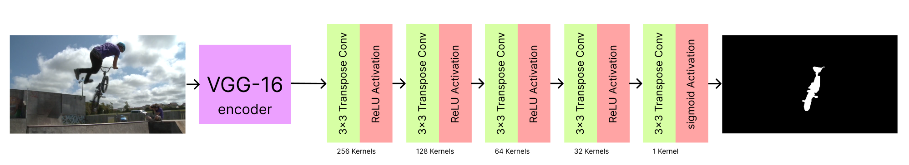
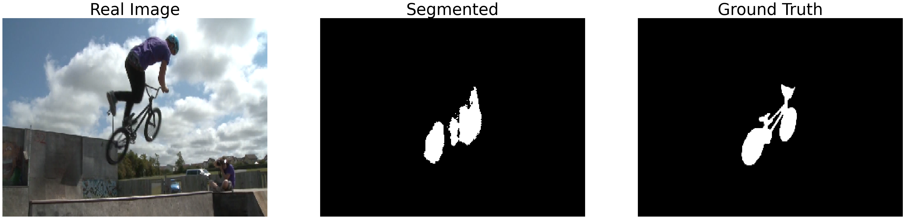

# Foreground Segmentation with VGG16 on SegTrackV2

We develop an object segmentation model using transfer learning with **VGG16 network** by removing the fully connected layers from the model and fine tuning it with Transpose Convolution networks to a binary image.

### VGG 16 Architecture
Following is the architecture of VGG16 model which was trained for object classification and detection


### Architecture
The modified architecture for this project is as follows



### Result
We trained this model over the **SegTrack v2 Dataset** for foreground segmentation and achieve an accuracy around 98%. Following is a comparision over the ground truth



### Setup
To run the model, enter the virtual enviornment using
```
source venv/bin/activate
```
and then install the packages using `pip` from `requirements.txt`
```
pip3 install -r requirements.txt
```
and then start executing scripts from [test.ipynb](test.ipynb).